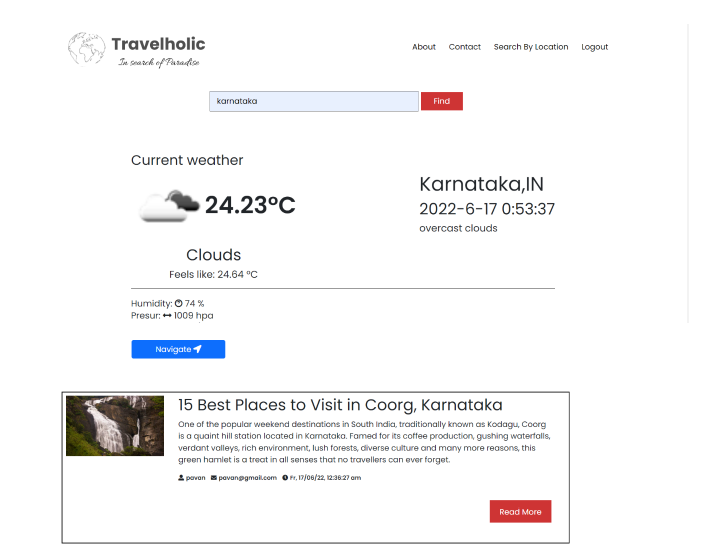
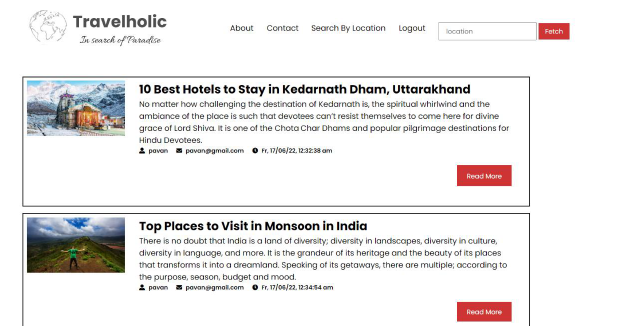
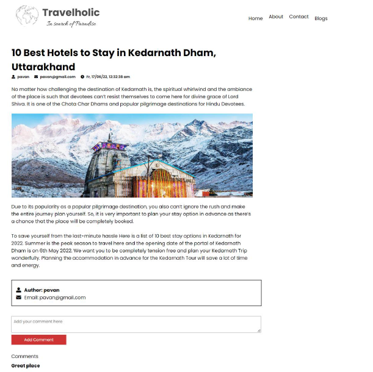

# 🧭 Travelholic – In Search of Paradise

**Travelholic** is a responsive travel blogging application built using the **MEHN** stack: **MongoDB**, **Express.js**, **Handlebars**, and **Node.js**. It is designed for users who want to explore travel blogs, search locations, and post their own experiences through a seamless and engaging web platform.


---

## ✨ Features

- 🖼️ Beautiful and responsive design
- 🔐 User Authentication (Sign Up / Sign In)
- 🔍 Blog search by location
- 📚 Read blogs with images and detailed content
- ✍️ Blogger portal for publishing travel experiences
- ☁️ Image hosting powered by Cloudinary

---

## 🚀 Tech Stack

| Category       | Technology                |
|----------------|---------------------------|
| Frontend       | HTML5, CSS3, JavaScript, Handlebars |
| Backend        | Node.js, Express.js       |
| Database       | MongoDB Atlas (AWS - Asia Pacific Mumbai) |
| Image Storage  | Cloudinary                |
| Dependencies   | Mongoose, body-parser, express, dotenv, bcrypt, etc. |

---

## 🧩 Functional Requirements

- ✅ Responsive Design for various screen sizes
- ✅ User Authentication & Authorization
- ✅ Blog creation and editing for authenticated bloggers
- ✅ Blog search by location

---

## 🔐 Non-Functional Requirements

- ✔️ Usability: Intuitive UI/UX
- ✔️ Security: Hashed passwords, secure routes
- ✔️ Performance: Optimized server-side rendering and image delivery

---

## 📸 Screenshots

### 🏔️ Search page


### 🔐 Sign In / Sign Up


### 🧭 Blog List


### 📝 Blog Detail Page


---

## 🛠️ Installation

```bash
# Clone the repository
git clone https://github.com/pavanshetty-in/Travel-Blog.git
cd travelholic

# Install dependencies
npm install

# Create .env file with your config (MongoDB URI, Cloudinary keys)
cp .env.example .env

# Run the application
npm start
